<p align="center">
  
</p>

<p align="center">
  <a href="https://www.linkedin.com/in/murat-ugur"></a>
  
  
</p>

<p align="center">
  <a href="https://github.com/Murat-UGUR">
    
  </a>
</p>

---

### 🛡️ About me

I'm a **Security Technical Operations Specialist** at **Barikat Siber Güvenlik**. I manage enterprise security infrastructure on **Trellix** and run proactive security validation with **Picus Security**.

Before that I spent nearly four years leading **end-to-end deployments of the full McAfee / FireEye portfolio** across physical and virtual environments. That covered ePO hierarchies, the DXL fabric, TIE, large ENS/HX rollouts, EX/FX/IVX appliances, DLP and Drive Encryption.

I like to **automate what I would otherwise click through**. This GitHub is where I publish that tooling.

```yaml
role:      Security Technical Operations Specialist @ Barikat Siber Güvenlik
focus:     [Endpoint Security, EDR/EPP, Threat Intel Fabric, Data Protection, Security Validation]
platforms: [Trellix ePO, ENS, HX, EX, FX, IVX, CM, TIE, DXL, DLP, Drive Encryption]
backend:   [SQL Server / T-SQL, VMware, Hyper-V]
coding:    [Python, T-SQL, Rust]
languages: [Turkish, English]
```

### 🧭 What I work on

| Area | Highlights |
|---|---|
| 🖥️ **Endpoint protection & EDR** | Large-scale **ENS / HX** deployments, behavioral-analysis tuning to cut false positives while keeping visibility |
| 🧠 **Threat-intel fabric** | **DXL** fabric architecture for cross-product messaging, **TIE** server integration for real-time reputation |
| 🗂️ **Central management** | Designing and scaling **ePolicy Orchestrator** hierarchies, plus SQL Server back-end performance and storage tuning with T-SQL |
| ✉️ **Email, file & sandbox** | Full-cycle **EX** (Email Security) and **FX** (File Protect) rollouts, **IVX** sandbox configuration for deep inspection |
| 🔐 **Data protection** | **DLP** strategy, File & Removable Media Protection, enterprise **Drive Encryption** lifecycle |
| 🎯 **Security validation** | Breach & attack simulation with **Picus Security** |
| 🏗️ **Infrastructure** | **VMware / Hyper-V** environment design as a deployment prerequisite |

### 🚀 Featured projects

| Project | Description | Stack |
|---|---|---|
| [**compliance-hunter**](https://github.com/Murat-UGUR/compliance-hunter) | Daily Trellix ePO health check. Finds hosts with stale DATs or no check-in, tags them through the ePO Web API and alerts via webhook. Ships with a mock ePO server and CI. | Python · ePO Web API · pytest |
| [**epo-db-health**](https://github.com/Murat-UGUR/epo-db-health) | Read-only T-SQL diagnostics for the ePO SQL Server database: size per table, index fragmentation, log growth, event volume, stale agents. | T-SQL · SQL Server |
| [**ShadowGuard**](https://github.com/ezetrol4/shadowguard) *(contributor)* | Endpoint-first AI security platform. I build the TCP network-telemetry collector and its ground-truth validation. | Rust · Windows API |

### 📜 Certifications

_2023-C01818?style=flat-square)


-C01818?style=flat-square)


### 🎓 Education

- **M.Sc. Cybersecurity**, Ahmet Yesevi University *(2025)*. Thesis: *Mathematical comparison of EDR vs. AV/EPP models*, an analytical benchmark of Endpoint Detection & Response against traditional antivirus and endpoint protection platforms.
- **B.Sc. Mechanical Engineering**, Gaziantep University *(2021)*. Graduation project: an autonomous-system framework built on **ROS**.

<details>
<summary><b>💼 Experience</b></summary>
<br/>

**Security Technical Operations Specialist**, Barikat Siber Güvenlik · *06/2026 – present* · Ankara
- Managing enterprise security infrastructure on Trellix
- Proactive security validation with Picus Security

**Cyber Security Specialist**, Ada Mühendislik ve Yazılım Hizmetleri · *09/2022 – 05/2026* · Ankara
- Led deployment, architecture and initial configuration of HX, EX, CM, FX, ENS, DLP, IVX, TIE, DXL, FRP, DE and ePO
- Designed and scaled ePO hierarchies; architected the DXL fabric; optimised TIE integration
- Drove large ENS/HX rollouts with behavioral-analysis tuning that reduced false positives
- Resolved console performance and log-storage bottlenecks with T-SQL queries and maintenance scripts
- Designed VMware / Hyper-V environments for product deployment

</details>

### 🧰 Tech stack


### 📈 GitHub activity

<p align="center">
  
  
</p>

---

<p align="center"><sub>🇹🇷 Ankara'da kurumsal uç nokta güvenliği, EDR/EPP ve güvenlik otomasyonu üzerine çalışıyorum. İletişim için LinkedIn.</sub></p>
